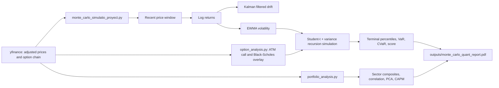

# Codebase audit and project map

## Purpose and bottom line

TRADELAB is an **equity scenario-analysis and reporting tool**, not a price-prediction system. It downloads adjusted market prices, estimates recent return and volatility conditions, simulates 252-day price paths, summarizes terminal risk, optionally compares an ATM option price with Black--Scholes, and produces a PDF report with portfolio analytics.

The code is a strong prototype: its modules are sensibly separated, the market-data column handling is defensive, and the deterministic helper tests pass. Before using its output to rank or trade assets, the project needs stronger reproducibility, input-failure handling, and out-of-sample model validation. Most importantly, its report must distinguish a **positive median scenario** from a **positive expected value**, and a **parameter-stability heuristic** from model calibration.

## System map

### Main components

| Location | Responsibility | Key output |
| --- | --- | --- |
| `monte_carlo_simulatio_proyect.py` | Orchestrates data download, calibration window, simulation, result ranking, and PDF generation. | `SimulationResult`, summary DataFrame, PDF. |
| `option_analysis.py` | Selects a near-horizon ATM option, calculates a Black--Scholes quote, and labels price gaps. | `OptionOverlayResult`. |
| `portfolio_analysis.py` | Builds sector composites and computes drawdown, Sharpe, correlations, PCA, and CAPM summaries. | `PortfolioAnalyticsResult`. |
| `MONTE_CARLO_SIMULATIO_PROYECT.ipynb` | Interactive walkthrough of the equity tool. | Tables and a PDF. |
| `tests/` | Deterministic checks for option and portfolio helpers. | 6 test functions. |
| `UFC/` | Three independent data-mining notebooks for UFC data. Their CSV inputs are not in the repository. | Not part of the equity tool. |
| `outputs/` | Generated PDF reports; currently ignored by Git. | `monte_carlo_quant_report.pdf`. |

## How the equity tool works

1. **Configuration** -- constants in `monte_carlo_simulatio_proyect.py:40-73` set the universe, 10,000 paths, 252-day horizon, a maximum 756-observation lookback, tail level, and report destination.
2. **Data acquisition** -- `get_stock_data` downloads auto-adjusted prices through yfinance. `get_close_series` accepts either common yfinance MultiIndex column order (`ticker/Close` or `Close/ticker`).
3. **Estimation** -- the engine restricts data to 2020 onward and the latest 756 observations. It applies a local-level Kalman filter to log returns for daily drift and EWMA to squared log returns for daily volatility.
4. **Simulation** -- `simulate_dynamic_gbm` evolves each path with standardized Student-t shocks (5 degrees of freedom) and a GARCH-like variance update. When options are available, it averages current EWMA volatility and the ATM option-implied volatility.
5. **Risk summary** -- it calculates the median terminal price, a central 95% terminal-price interval (2.5th--97.5th percentiles), 5% terminal VaR, 5% CVaR / expected shortfall, and `median return / abs(CVaR)`.
6. **Portfolio analytics** -- the separate portfolio module builds equal-weight sector composites, compares them to SPY, and reports correlation, PCA, CAPM, Sharpe, and drawdown.
7. **Reporting** -- a multi-page PDF is written to `outputs/monte_carlo_quant_report.pdf`; the main script runs the multiple-ticker workflow by default.

## What can be trusted today

- The code compiles successfully with the active Python interpreter.
- All six existing deterministic test functions pass when invoked directly.
- The option Black--Scholes reference-price test and the synthetic portfolio test give useful regression coverage for their small helper scopes.
- The simulation uses adjusted prices, log returns, a recent-regime window, heavy-tailed shocks, and terminal expected shortfall. Those are appropriate ingredients for a scenario engine.
- The report correctly avoids presenting one path as a deterministic forecast; it exposes a distribution and tail statistics instead.

## Findings and improvement order

Severity reflects the potential to mislead decisions or prevent reliable execution. Priorities are intentionally ordered: complete P0 before relying on ranking output, then P1 for reliable operation, then P2 for maintainability.

| Priority | Finding | Evidence | Why it matters | Recommended resolution |
| --- | --- | --- | --- | --- |
| P0 | **The report treats a positive median and score as “EV positive.” They are not expected value.** | `calculate_asymmetry_score` uses median return, not mean payoff; report policy text calls for “EV primero.” | A skewed terminal distribution can have positive median but negative mean, or the reverse. This can reverse a decision rule. | Add `mean_final_return`, probability of gain, and an explicitly defined payoff/cost model. Rename the current metric to `median-to-tail score`; never equate it to EV. |
| P0 | **“Calibration” is not model calibration or forecast validation.** | `calibration_error` (`monte_carlo_simulatio_proyect.py:199-209`) only measures recent movement in estimated drift and volatility; the 0.08 threshold is unvalidated. | `CALIBRADO` can be read as proven accurate even though it has not been tested against realized returns or coverage. | Rename it to `parameter_stability_score`. Add rolling out-of-sample backtests: distribution coverage, VaR exception rate, CVaR loss severity, and benchmark comparison. Set thresholds from backtest evidence. |
| P0 | **The option BUY/SELL labels are model gaps, not executable trade recommendations.** | `generate_option_signal` (`option_analysis.py:186-215`) classifies solely from market/model price ratio; pricing uses a fixed 5.3% rate. | Bid/ask spread, liquidity, dividends, early exercise, stale last price, volatility surface, and transaction costs can overwhelm the gap. | Rename actions to `MODEL_RICH`, `MODEL_CHEAP`, and `MODEL_ALIGNED` until a documented, backtested strategy exists. Enforce spread/open-interest/volume checks and source a dated risk-free curve. |
| P0 | **No random seed or run manifest makes results non-reproducible.** | Shocks are drawn through global `scipy.stats.t.rvs` (`:212-214`); the PDF only records broad configuration. | The same inputs give different rankings, and an old report cannot be recreated exactly. | Accept a `numpy.random.Generator` or seed in the simulation, store seed, as-of timestamp, package versions, tickers, all parameters, and data hashes with every report. |
| P1 | **One invalid or unavailable ticker stops the entire equity batch.** | Default universe includes several symbols (`:44`); loop at `:1381-1385` has no per-ticker recovery. | Live downloads change shape and symbols can be unavailable. A single failure prevents a report for valid assets. | Validate the universe first; process each ticker inside a narrow `try/except`; record skipped tickers and reasons in the summary/report. Confirm intended exchange suffixes. |
| P1 | **The data source is live and unversioned.** | `yf.download` (`:119-123`) and option-chain calls depend on current external state. | Report results change with download time, market close status, yfinance revisions, and option-chain availability. | Add an `as_of` field, cache raw adjusted prices/options per run, record yfinance version, and provide a local-data mode for tests and reproducibility. |
| P1 | **The portfolio construction is a normalized, equal-weight research composite, not a fully specified investable portfolio.** | Sector values are arithmetic means of base-100 prices and the portfolio is the mean of sectors (`portfolio_analysis.py:210-218`). | Results do not state holdings, weights, rebalance policy, cash, trading costs, or corporate-action treatment. | Expose a weights table and rebalance frequency. Label current implementation “static equal-weight sector composite,” or implement explicit rebalancing. |
| P1 | **Forward filling missing prices can fabricate zero returns.** | `build_close_frame` forward-fills every missing observation (`portfolio_analysis.py:79-80`). | IPOs, delistings, halted symbols, and data gaps can distort correlations, PCA, beta, and volatility. | Use common trading dates or a documented maximum gap; reject assets with insufficient history; report coverage and missing-data exclusions. |
| P1 | **The drift and volatility assumptions are highly sensitive but untested.** | Daily drift is the last Kalman estimate; volatility blends EWMA and option IV; Student-t df, alpha, beta, lambda, and thresholds are fixed constants. | Small changes in daily drift compound materially over 252 days, while hand-set parameters can dominate the output. | Add parameter sensitivity tables, estimate/refit variance dynamics, and compare against simple historical bootstrap / constant-volatility baselines in walk-forward tests. |
| P1 | **The report wording needs tighter statistical labels.** | “Piso 95%/Techo 95%” are 2.5th/97.5th percentiles; VaR/CVaR are terminal-horizon simulated returns. | Users may treat them as a prediction interval, a price floor, or a stop-loss guarantee. | Label the range “central 95% simulated terminal-price interval”; label VaR and CVaR with horizon, confidence, and simulation basis. Include a one-line no-guarantee warning. |
| P1 | **Risk-free rate and option maturity conventions are hard-coded.** | `DEFAULT_OPTION_RISK_FREE_RATE = 0.053`; expiration uses midnight UTC (`option_analysis.py:76-80`). | Option theoretical prices and time decay can be materially affected, especially near expiry. | Parameterize rate/dividend yield and date convention; record their source and as-of date; use market close time for expiry. |
| P2 | **No dependency lockfile, package metadata, or current root README exists.** | No `requirements*.txt`, `pyproject.toml`, or tracked `README.md` is present. | A new user cannot recreate the validated environment or discover the entry points without inspecting code. | Add `requirements.txt` with tested minimum versions, a concise root README linking here, and optionally `pyproject.toml` / `ruff` configuration. |
| P2 | **Test coverage misses the engine and failure cases.** | Tests cover option helpers and one synthetic portfolio result; no simulation, report, data-shape, or error-path tests. `pytest` is absent from the active environment. | Core ranking behavior and yfinance edge cases can regress silently. | Add seeded simulation tests, flat/MultiIndex price fixtures, invalid ticker tests, portfolio missing-data tests, and report smoke tests. Install and run `pytest`. |
| P2 | **Global import side effects and duplicated helpers hinder reuse.** | Warnings are globally suppressed/redirected (`:34`, `:116`); `get_close_series` is duplicated in the main and portfolio modules. | Importing a module changes process-wide warning behavior, and duplicated logic can diverge. | Move runtime configuration into `main()`/setup, and extract shared data-access functions into a small helper module. |
| P2 | **The simulation loop is not performance-oriented.** | 10,000 × 252 scalar iterations and individual Student-t draws (`:301-316`). | The default universe can be slow and makes experimentation expensive. | Generate shocks in vectors / batches, benchmark runtime and memory, then retain a seeded reference test to ensure the refactor preserves behavior. |
| P2 | **Repository boundaries are unclear.** | `UFC/` is an unrelated notebook project; required CSVs are absent. The four notebooks retain execution outputs. | It dilutes the equity project and is not runnable from a clean clone. | Move UFC work to a separate repository or `archive/` with its own README, requirements, data provenance, and tests. Clear stale notebook output or publish data-reproduction instructions. |
| P2 | **File modes are unintentionally dirty.** | All tracked files currently show `100644 => 100755`, including `LICENSE` and notebooks. | Creates noisy diffs and incorrectly marks non-executable assets as programs. | Restore non-executable modes before the next commit; retain executable permission only where deliberately needed. |
| P2 | **Defined report policy is not emitted.** | `add_policy_page` exists but `create_pdf_report` calls methodology directly (`:1327-1335`). | A useful governance explanation never reaches report readers. | Either add the policy page to PDF creation or remove/merge it to avoid dead presentation code. |

## Assumptions ledger

These are not automatically wrong; they must be explicit because they determine what the output means.

| Area | Current assumption | Interpretation / limit |
| --- | --- | --- |
| Prices | yfinance adjusted close prices are accurate and representative. | Depends on source availability and revisions; it is not an audited market-data feed. |
| Regime | The last 756 trading observations after 2020 define the relevant regime. | Ignores older history and may not represent the next year. |
| Drift | The final Kalman state is tomorrow’s daily expected log return. | Drift is noisy and dominates long horizons; treat it as a scenario input, not a forecast fact. |
| Volatility | EWMA with λ=0.94 plus equal-weight ATM IV averaging is appropriate. | IV and historical volatility represent different information sets and should not be blended without validation. |
| Tail behavior | Standardized Student-t with 5 df captures shocks. | Symmetric, independent innovations within the variance process cannot model jumps, skew, liquidity gaps, or regime changes directly. |
| Variance dynamics | α=0.08 and β=0.90 are suitable across all assets. | Persistence is imposed rather than estimated per ticker. |
| Horizon | 252 simulated trading days represent the intended holding period. | There is no interim rebalancing, stop loss, dividend/cashflow policy, or path-dependent payoff in the equity metric. |
| Tail risk | 5% terminal return VaR/CVaR captures the relevant risk. | Does not capture maximum drawdown, intrahorizon margin risk, or liquidity risk. |
| Portfolio | Equal-weight normalized sector composites approximate a portfolio. | This is a research index, not an allocation mandate. |
| CAPM/PCA | Historical linear relationships describe the current risk structure. | Both are descriptive, can shift abruptly, and require complete/clean aligned data. |
| Options | An ATM call and Black--Scholes with no dividend yield are sufficient comparison inputs. | It is an indicative model diagnostic, not an options valuation or trading system. |

## Current output guide

| Output field | Meaning today | Safe reading |
| --- | --- | --- |
| `Mediana simulada` / `Cambio % vs actual` | 50th percentile terminal price / return. | Typical simulated terminal outcome, not a target price or EV. |
| `Piso 95%` and `Techo 95%` | 2.5th and 97.5th percentiles of terminal price. | Central simulated interval; 5% of *model* paths fall outside it. |
| `VaR 5%` | 5th percentile of terminal return. | A modelled 1-year terminal loss percentile, not a maximum possible loss. |
| `CVaR 5%` | Mean terminal return among paths at or below VaR 5%. | Modelled expected shortfall in the worst 5% terminal scenarios. |
| `Score asimetria` | Median return divided by absolute CVaR. | Direction/tail heuristic only; not expected value, Sharpe, or probability of profit. |
| `Estado modelo` | Thresholded short-term movement in fitted drift/volatility. | Parameter-stability flag; not evidence of calibration or predictive accuracy. |
| `Senal opcion ATM` | Market/model premium ratio threshold. | A model-disagreement flag, not a buy/sell instruction. |
| Portfolio Sharpe / beta / alpha | Historical statistics of the constructed sector composite. | Descriptive sample measures, not guaranteed forward performance. |

## Recommended delivery plan

### Phase 1 — Make the current tool honest and reproducible

1. Rename misleading report terms (`EV`, `calibrated`, option `BUY/SELL`) and add the actual mean return / probability of profit.
2. Add seed, as-of time, parameter manifest, package versions, and cached raw market data to each report run.
3. Fail gracefully per ticker and print/report data-quality exclusions.
4. Add a root README and locked/tested dependency definition.

### Phase 2 — Prove or revise the model

1. Build a walk-forward backtest with fixed historical as-of dates.
2. Measure interval coverage, VaR exceptions, expected-shortfall behavior, mean/median bias, and ranking performance after costs.
3. Compare the existing model with historical bootstrap and simpler GBM/EWMA baselines.
4. Use results to set the lookback, Student-t df, volatility blend, α/β, and stability threshold—or remove parameters that do not improve validation.

### Phase 3 — Turn it into a maintainable research tool

1. Move configuration to a typed config object or CLI; move shared market-data logic to a helper module.
2. Add tests for simulation determinism, data fixtures, failures, and report generation; run them in CI.
3. Define portfolio weights/rebalancing and missing-data policy.
4. Separate/archive the UFC notebooks and give each project its own documented environment.

## Verification performed

| Check | Result |
| --- | --- |
| Python syntax compilation for the three `.py` modules | Passed. |
| Existing option and portfolio test functions | Passed when invoked directly. |
| `pytest -q` | Could not run: `pytest` is not installed in the active Python environment. |
| Live yfinance download / full report generation | Not run during this audit; it depends on network access and live market data. An existing 6.5 MB PDF is present in `outputs/`. |
| Notebook inspection | Equity notebook: 10 cells / 7 code outputs. UFC notebooks: 9--26 cells / 5--16 code outputs. |
| Security scan by source inspection | No credentials, shell execution, dynamic code execution, or direct destructive file operations found. |

## Suggested next edit

Start with Phase 1, item 1: update the `SimulationResult`, summary table, report wording, and tests so every displayed measure says exactly what it computes. That single change will make the tool substantially easier to explain and much safer to use while the validation work proceeds.
